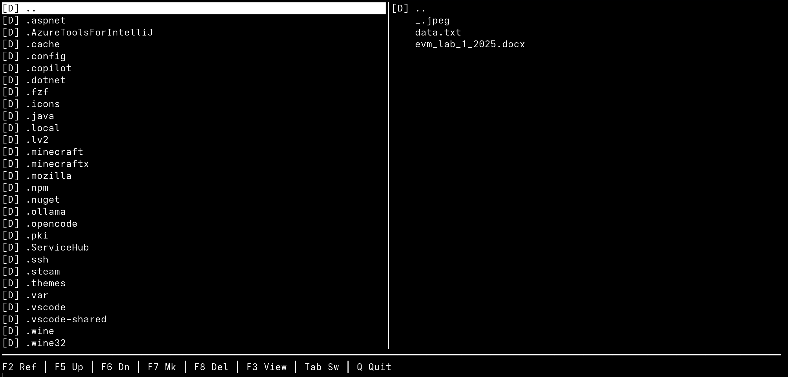
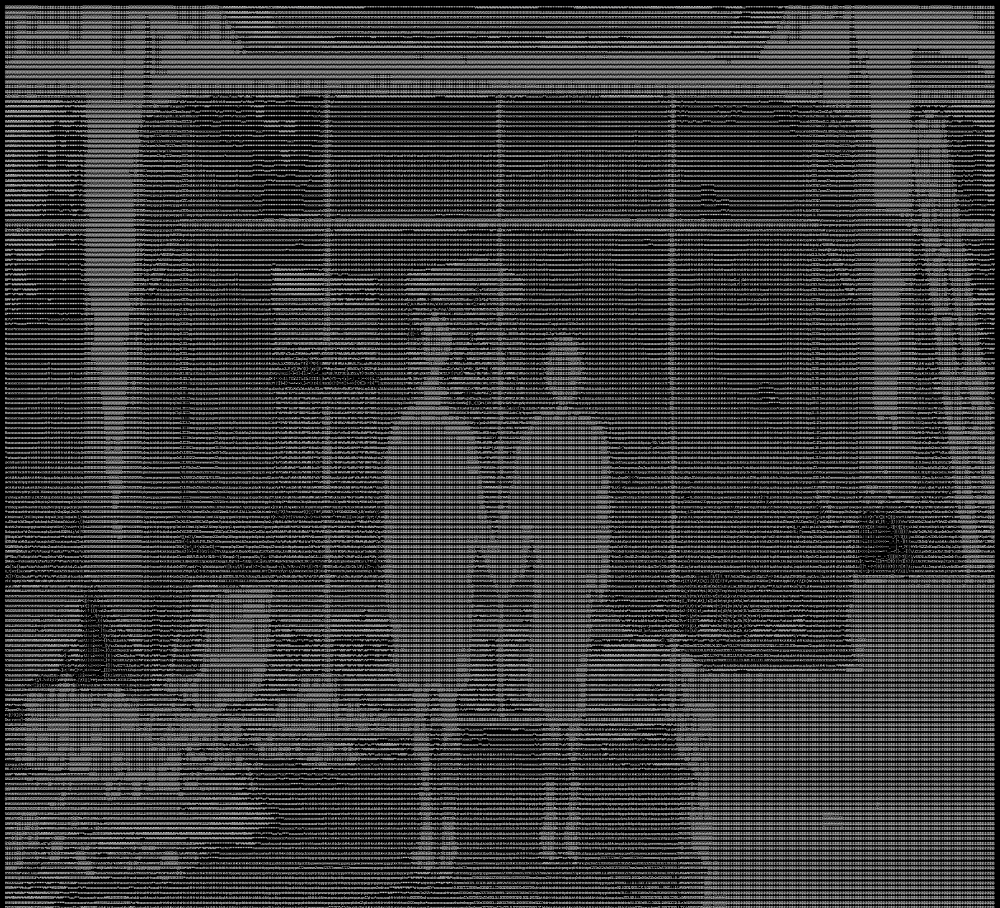

<div align="center">

# LocalCloudeStorage

### Собственное кроссплатформенное облачное хранилище на своём сервере, с консольным файл-менеджером и просмотром изображений / видео в виде ASCII-арта.

[](https://dotnet.microsoft.com/)
[](https://dotnet.microsoft.com/)
[](https://dotnet.microsoft.com/)
[](https://go.dev/)

</div>

---

## Скриншоты





**P.S. Для просмотра фото нужно уменьшать масштаб в терминале, иначе вряд-ли можно будет что-то разобрать**

## Возможности

- **Своё хранилище** — файлы остаются на вашем сервере, без посредников.
- **Консольный TUI файл-менеджер** — две панели (локально / на сервере), в стиле Midnight Commander.
- **Загрузка / скачивание / удаление / создание папок** с встроенной проверкой ввода.
- **Просмотр фото как ASCII** — изображения рисуются прямо в терминале, автоматически вписываясь в размер экрана.
- **Видео как ASCII** — видео проигрывается покадрово в виде ASCII-арта.
- **Запуск одной командой** — настроил один раз, потом просто `csc`. Токен и URL вводить больше не нужно.
- **Кроссплатформенность** — клиенты под Linux / macOS / Windows, бэкенд на Go под любой Linux-сервер.

---

## Обзор

LocalCloudeStorage — небольшое облачное хранилище: ваши файлы лежат на
собственном сервере и доступны из терминала. Проект состоит из четырёх частей:

1. **`cloud-storage-backend`** — крошечный REST API на Go (загрузка / скачивание / список / удаление / создание папок) под защитой bearer-токена, изолированный в корне хранилища.
2. **`cloud-storage-client`** — интерактивный двухпанельный TUI на C# (.NET 10). Без внешних UI-библиотек, только консоль.
3. **`image-viewer`** / **`video-viewer`** — утилиты на C#, превращающие изображения и видео в ASCII-арт прямо в терминале.
4. **`CloudStorage.Shared`** — общая библиотека на C# (HTTP-клиент, ASCII-рендерер, загрузчик `.env`, разбор CLI-аргументов), используемая всеми клиентскими проектами.

Всё общается по обычному HTTP + JSON, поэтому работает за Tailscale / VPN между вашим компьютером и сервером.

---

## Требования

- **Сервер:** любой Linux с установленным Go (либо просто готовый бинарник).
- **Клиент:** .NET 10 SDK на вашем компьютере (Linux / macOS / Windows ||| Гарантии не даю, тестировал только на CachyOS).

---

## Установка

В проекте используется **один общий токен**. Он генерируется единожды скриптом
`setup.sh` и затем переиспользуется и клиентом, и деплоем бэкенда — вводить его дважды
не нужно, и две стороны никогда не рассинхронизируются.

### Шаг 1 — клиент (один раз)

Из корня репозитория:

```bash
./setup.sh
```

Он соберёт клиент и два просмотрщика (а также общую библиотеку `CloudStorage.Shared`,
от которой они зависят), один раз спросит **URL** бэкенда, сгенерирует токен и сохранит
его в два места:

- `./.env` в этом репозитории — его берёт `deploy.sh` бэкенда, и
- `~/.config/csc/.env` — его берёт клиент,

а также установит лаунчеры `csc` / `vview` в `~/.local/bin`. После этого перезапустите
оболочку (или `source ~/.zshrc` / `source ~/.bashrc`).

> Если ваш сервер уже работает с каким-то токеном, задайте `STORAGE_TOKEN=...` в `./.env`
> (см. `.env.example`) **до** запуска `setup.sh`, чтобы клиент взял именно его.

### Шаг 2 — бэкенд (сервер)

Токен берётся из того же `./.env`, поэтому просто деплоим:

```bash
cd cloud-storage-backend
./deploy.sh <ip-сервера>      # напр. ./deploy.sh 100.91.32.58
```

SSH подключается к серверу под пользователем сервера, используя SSH-ключ компьютера,
с которого выполняется деплой (добавьте `Host` в `~/.ssh/config` или задайте
`SERVER_USER=admin`). При первом запуске скрипт один раз спросит sudo-пароль, чтобы
включить passwordless-sudo для будущих деплоев; дальше деплой полностью неинтерактивный.

`deploy.sh` собирает Linux-бинарник, копирует его на сервер, ставит systemd-юнит и
записывает **тот же** `STORAGE_TOKEN` в `/etc/cloud-storage.env` на сервере
(`chmod 600`, не в репозитории и не в логах).

---

## Использование

После настройки повседневный запуск — одна команда:

```bash
csc            # запуск TUI файл-менеджера
```


> `csc` берёт URL / токен из `~/.config/csc/.env`. После первой настройки их вводить не
> нужно. Текущие локальная и удалённая папки запоминаются между запусками.

---

## Управление (TUI)

| Клавиша | Действие |
|---------|----------|
| ↑ / ↓ | Перемещение выделения |
| Tab / ← / → | Переключить активную панель |
| Enter | Открыть папку / предпросмотр изображения (ASCII) |
| F2 или `r` | Обновить обе панели |
| F5 или `u` | Загрузить выделенный локальный файл на сервер |
| F6 или `o` | Скачать выделенный файл с сервера |
| F7 или `n` | Создать папку |
| F8 или `x` | Удалить (с подтверждением) |
| F3 или `v` | Просмотр изображения как ASCII |
| Q / Esc | Выход |

> В некоторых терминалах функциональные клавиши не доходят до консоли, поэтому у каждого
> действия есть и буквенная комбинация (`r/u/o/n/x/v`).

---

## Заметки по безопасности

- Все API-вызовы (кроме `/api/health`) требуют `Bearer`-токен.
- Пути изолированы внутри `STORAGE_ROOT`; попытки "выйти наружу" отклоняются.
- Токен хранится в `~/.config/csc/.env`. Держите серверный токен в секрете.

---

## Лицензия

Проект распространяется по лицензии [MIT](LICENSE).
